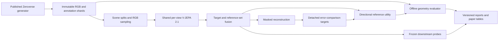

# burn_gekko research and engineering roadmap

September 29 objective amendment: the next primary experiment predicts fixed
V-JEPA 2.1 latent features instead of RGB pixels. See the implemented
[latent pipeline](docs/latent-pipeline.md). Earlier RGB pilots and their failed
sharpness gates remain recorded; changing the task does not resolve those failures.

The latent study sequence is: verify teacher isolation and sparse-input contracts;
measure a bounded 256-room screen against matched monocular, unrelated-reference,
and training-only constant predictors; validate feature diversity and geometric
co-visibility; then condition larger training and fresh-scene evaluation on a
positive reference-utility result. The fixed teacher stays frozen while the
student unfreezes after the measured gate. A momentum teacher, hierarchical
targets, V-JEPA-style multi-block masks, and auxiliary RGB probes are later
controlled ablations. Random versus compact-visible-island masking is now
implemented; it does not reproduce V-JEPA's multi-block sampler.
Latent cosine/MSE cannot substitute for correspondence or visibility evaluation.

The [SOTA evidence program](docs/sota-evidence.md) and
[benchmark registry](configs/benchmark-registry.toml) now define the next
qualification gates. Common-mask checkpoint assessment, RGB-only correspondence
readouts, frozen-encoder controls, paired uncertainty, and HPatches transfer are
implemented. Published-number parity, independent training seeds, variable-view
qualification, local refinement and ETH3D evaluation remain open. The initial
planning tables below are historical specifications, not current package pins.

Planning snapshot: 2026-09-27. This document specifies future work; unchecked
items and proposed numbers are not implementation or experimental evidence.
Implementation started after this planning snapshot. The current bounded
preflight and small GPU study are tracked separately in
[implementation status](docs/implementation-status.md) and
[pilot 01](docs/pilot-01.md); this roadmap still
defines the larger qualification and research work. All current generated
artifacts use `./.data/`, superseding illustrative `data/` paths below and in the
planning documents.

Current engineering evidence is tracked in [pilot 05](docs/pilot-05.md) and the
[end-to-end guide](docs/e2e-pipeline.md). Random and MIT-initialized encoders now
train with fresh fusion heads, gated unfreezing, optimizer continuation, immutable
room caches and exported RGB/geometry evaluations. These engineering results do
not close the controlled objective, variable-view, sparsity or transfer studies
below. The original backlog is retained as a research specification.

## Research objective

The current project constraint is end-to-end training without pretrained weights
carrying a noncommercial license. All fusion and reconstruction heads start
randomly; encoders may start randomly or from an audited commercial-use-compatible
release. Pretrained encoders unfreeze after measured trunk stabilization. Pilot 04
Gekko weights and all derived checkpoints are comparison baselines only, excluded
from candidate initialization, decoder warm starts, and teacher supervision.
The new implementation is documented in [the end-to-end guide](docs/e2e-pipeline.md).

Train a reusable, variable-view fusion model in Burn over independently encoded
V-JEPA 2.1 image features. The model should learn correspondences and predict
where another view supplies useful information, using latent prediction as the
current primary training signal and retaining RGB reconstruction as a diagnostic.
Establish this on reproducible procedural indoor scenes, then
measure transfer to real indoor imagery and the quality/cost tradeoff of sparse
per-view encoding.

The proposed contribution is the combination of **budgeted per-view encoding,
set-conditioned fusion, and measurable self-supervised reference utility**.
Whether that combination improves geometry or efficiency is an experimental
question. Reimplementing the original Gekko objective or replacing its encoder
alone is insufficient evidence of a new research contribution.

The [Gekko paper](https://arxiv.org/abs/2609.01530) motivates error-comparison
supervision. [MuM](https://arxiv.org/abs/2511.17309) and
[Muskie](https://arxiv.org/abs/2511.18115) are relevant multi-view prior work;
the study must compare against that research direction as well as CroCo.

## Decisions to carry into implementation

| Area | Initial decision | Revisit when |
| --- | --- | --- |
| Dataset | Published `bevy_zeroverse =0.23.0`, `bevy_zeroverse_burn =0.6.0`; offline immutable captures, 256px procedural rooms | Larger distribution and geometry qualification |
| Encoder source | Copy a documented subset of the root `burn_jepa` crate into `crates/burn_jepa` | P1 reveals an unavoidable dependency or parity issue |
| Backbone | V-JEPA 2.1 Base, native image path, frozen initially | The decoder baseline and encoder parity pass |
| Model input | RGB, masks, original token positions, view membership | Calibration-conditioned ablations begin |
| Decoder | Shared CroCo-style target decoder; Base reference dimensions, with a smaller diagnostic profile | Measured memory/throughput justify scaling |
| Self-supervision | Masked cross-view RGB + masked monocular RGB + detached error-comparison regression | Ablations identify a reproducible limitation |
| Co-visibility | Directional relative-improvement score, evaluated against geometric visibility | Separate probability calibration is fitted and evaluated |
| Multi-view | One target attending to an unordered reference set; pairwise and set outputs remain distinct | P4 validates the pair objective |
| Sparsity | Independent, stateless per-view token selection before contextual encoding | Dense and sparse baselines pass |
| Temporal state | Deferred; same-camera history only in a separate experiment | Stateless sparse results justify complexity |
| Hardware | User-selected single workstation GPU; scale only if justified | Measured throughput and scientific gains support expansion |
| Delivery | Rust model/trainer/evaluator; Python only for upstream parity and analysis where useful | A missing backend feature needs a documented fallback |

The available workstation reports an NVIDIA RTX PRO 6000 Blackwell with
97,887 MiB total device memory and driver 610.43.02. This is an inventory reading,
not a memory/throughput qualification. Capture and training initially run at
different times on that GPU. See [resource planning](docs/training-plan.md).

The current `burn_jepa` encoder core is in the root crate, not a standalone
`crates/vjepa` package. Its complete workspace includes unrelated reconstruction,
viewer, and temporal-adaptation systems. The import is an explicit dependency
slice, not a recursive workspace copy. See [the import plan](docs/repository-plan.md).

The original planning audit inspected 0.21.0/0.4.0, which lacked the shared-target
camera sampler. The subsequent 0.22.0/0.5.0 upgrade includes it, and the pilot
enables a connected three-view rig. Its proxy overlap constraint is not a rendered
pixel guarantee; the pilot measures all directed view pairs independently.

The user authorized an additional appearance encoder in pilot 04, prioritizing
reconstruction quality. That historical baseline combines frozen V-JEPA 2.1 Base
and released Gekko-L appearance features, shared pairwise reconstruction, learned
standalone RGB calibration, and selective decoder adaptation. This is a separate
architecture from the original V-JEPA-only/set-attention proposal above; see
[the pilot 04 evidence](docs/pilot-04.md). It does not establish a benefit from
joint set attention, isolated V-JEPA semantics, or sparse reference encoding.

## System flow

Annotations enter evaluation and explicitly named supervised experiments.
The main pretraining loader exposes RGB and sampling identities only. All views
are encoded separately; camera index is never treated as video time.

## Milestones and acceptance gates

Indicative durations are engineering estimates for one contributor with suitable
GPU access. They exclude measured training/rendering time and are not deadlines.
Work on paper structure and dataset audits continues throughout.

| Phase | Work and deliverable | Acceptance gate | Dependency / indicative effort |
| --- | --- | --- | --- |
| P0 | Freeze hypotheses, data regimes, source revisions, budgets, metric definitions | A run specification can be reviewed without guessing loss, sampling, or stopping rules | This roadmap; 1–2 days to finalize implementation specifications |
| P1 | Import the encoder slice, strict checkpoint conversion, CPU/GPU parity fixtures | Required encoder tensors all load; native image, masked image, positional, and backend checks pass | P0; 3–6 days |
| P2 | Package-isolated generator, shards, splits, geometric evaluator | Analytic and rendered reprojection checks; exact metadata round trips; no scene leakage; bounded generation pilot | P0; 4–8 days |
| P3 | Tiny decoder and loss implementation; analytic gradients and leakage checks | Correct three-path information flow; tiny overfit; finite loss; reproducible resume | P1 plus P2 fixtures; 3–6 days |
| P4 | Matched two-view CroCo, MAE+CroCo, and Gekko-objective studies | Held-out utility and correspondence results exceed appropriate controls, or a documented negative finding explains the stop | P3; 1–2 weeks plus bounded training |
| P5 | Variable reference sets, pairwise utility, set utility, reference dropout | Reference-order invariance; correct empty/single-reference behavior; useful gain over pair pooling at controlled compute | P4; 1–2 weeks plus experiments |
| P6 | Sparse encoder and fusion budgets | Actual end-to-end cost decreases with declared quality limits; mask-conditioned proxy targets remain correct | P5; 1–2 weeks plus experiments |
| P7 | Frozen probes, optional partial unfreeze, real-domain evaluation | Geometric metrics and transfer evaluated on fixed splits; supervision and adaptation disclosed | P4; P5/P6 for their claims; 1–2 weeks plus experiments |
| P8 | Locked confirmatory study, multi-seed runs, reproducibility bundle | Predeclared primary comparisons completed; confidence intervals and all failures retained | Selected P4–P7 variants; compute-dependent |
| P9 | Paper, artifact package, model/data cards | Every claim maps to an immutable result; source and weight terms recorded; figures regenerate | Starts at P0, closes after P8; 1–2 weeks |

P4 is the first scientifically useful endpoint. A two-view negative result should
trigger diagnosis before adding multi-view or temporal machinery. P6 is the first
endpoint that can support a sparse-efficiency claim. P9 can describe an honest
negative or bounded result; publication planning does not imply positive results.

## First implementation backlog

The order below deliberately closes correctness risks before expensive studies.

- [ ] P0-01: Select fixed pretrained checkpoint and record original/conversion hashes.
- [ ] P0-02: Register primary hypotheses, development limits, data splits, and study ledger.
- [ ] P1-01: Create the minimal workspace and import manifest, preserving licenses.
- [ ] P1-02: Copy encoder modules and relevant parity tests from an immutable revision.
- [ ] P1-03: Qualify native image embeddings, not just video micro-forward fixtures.
- [ ] P1-04: Make required weight mismatches fatal and validate an encoder-only export.
- [x] P2-01: Build the generator in its own pinned environment and archive its lockfile.
- [ ] P2-02: Capture the 32-scene qualification set and validate conventions analytically.
- [ ] P2-03: Build a versioned geometry sidecar and an RGB-only training interface.
- [ ] P2-04: Audit independent-camera overlap and short-trajectory pair distributions.
- [x] P3-01: Implement mask-aware target tokens and a common decoder for two branches.
- [ ] P3-02: Implement patch targets, both documented RI formulations, and gradient tests.
- [x] P3-03: Verify masked-pixel perturbations cannot affect reconstruction inputs.
- [ ] P3-04: Prove tiny overfit, deterministic sampling, checkpoint resume, and finite AMP behavior.
- [ ] P4-01: Run the fixed-budget three-way objective comparison with one seed.
- [ ] P4-02: Verify performance with swapped/unrelated references and texture strata.
- [ ] P4-03: Advance only the successful specification to independent confirmatory seeds.

Subsequent pilots completed the pinned encoder import and official EMA tensor
audit, dense/sparse CPU image parity, larger immutable captures, tiny overfit,
encoder backward passes, and deterministic CPU optimizer continuation. CUDA
encoder parity retains its recorded small numerical residual; AMP and the
controlled research baselines remain open. Current results and limits live in
the pilot documents. Example commands in the original detailed plans remain
proposals unless exposed by the current CLI.

## Research questions and falsification

| Hypothesis | Required comparison | Evidence against it |
| --- | --- | --- |
| H1: RI training improves useful fusion over reconstruction alone | Same frozen encoder, decoder, data and schedule: CroCo vs MAE+CroCo vs full objective | Better training loss with no held-out co-visibility/correspondence improvement |
| H2: Joint reference sets help beyond a collection of pairs | Joint set decoder vs pairwise feature pooling; fixed total reference tokens and equal GPU-hour analysis | Gain disappears at matched tokens/cost or when redundant views are removed |
| H3: Sparse per-view computation preserves useful geometry at lower cost | Dense encoder, sparse encoder, and dense-encode/gather control | Fewer output tokens without lower measured encoder or end-to-end cost |
| H4: Learned utility supports useful reference/token selection | Learned policy vs random, uniform, texture-based and oracle diagnostic selection | Selector overhead dominates or it systematically drops useful low-texture regions |
| H5: Synthetic training transfers | Untuned real-scene tests against the frozen V-JEPA baseline and matched fusion controls | Improvement exists only on generator-specific appearance/layouts |

H1/H2/H3 are the core study. H4 is optional after P6; H5 is needed for a broad
generalization claim. Do not expand to world modeling, action prediction, temporal
adaptation, or 3D reconstruction systems before these questions are answered.

## Decision rules for expansion

Use [training budgets](docs/training-plan.md) to stop a failed screen; log the
reason instead of quietly extending it. An extended run receives a new run ID and
is labeled as follow-up work. Fix bugs, then rerun all affected controls.

Advance from frozen to partially unfrozen encoders only if low-cost probes show
the frozen feature interface is the bottleneck. Advance from pairs to sets only
after reference-shuffle tests show genuine use of another view. Advance from
uniform sparsity to learned routing only after the measured quality/cost frontier
of the simple policy is known.

Proposed study-scale gates include a positive scene-bootstrap lower confidence
bound for the primary representation gain and, for a sparse operating point, at least
20% end-to-end latency reduction with at most 2 percentage points of co-visibility
AP loss and at most 5% relative AEPE degradation. These are **candidate practical
criteria**, to register before confirmation; they are not forecasts or achieved
numbers. Secondary metrics and failure strata remain visible even when the
primary gate passes.

## Main risks and responses

| Risk | Early diagnostic | Planned response |
| --- | --- | --- |
| Dense contextual features leak masked content | Change only hidden target pixels; compare encoder inputs/features | Apply masks before contextual encoder blocks; isolate caches |
| Frozen video-trained features poorly support heavily masked images | Dense/native-image parity and mask-ratio sweep | Image modality first; bounded mask curriculum or last-block adaptation |
| Geometric overlap is mistaken for reconstruction usefulness | Compare raw RI, predicted RI, and geometric labels by texture/material | Preserve the distinction in APIs, losses, metrics, and claims |
| Published cameras yield too few useful pairs | RGB cohort plus independent rendered-depth audit | Use short same-camera trajectories and measured curricula; separately label geometry-curated selection |
| Sparse targets change the task | Match reference subsets and target masks across error branches | Report both geometric co-visibility and conditional utility |
| Multi-view gains come from more compute | Fixed-token, fixed-step, and fixed-GPU-hour comparisons | Present separate comparisons rather than one ambiguous leaderboard |
| Synthetic appearance shortcuts | Room-family/material/camera OOD tests and shuffled references | Increase controlled diversity; evaluate real transfer before scaling claims |
| Renderer or dependency drift | Registry checksum, capture identity and lockfile checks | New dataset version; never append across incompatible contracts |
| Too much scope | Phase gates and bounded optional experiments | Finish pair, set, and sparsity studies before temporal extensions |

## Deliverable contract

The final project should provide an encoder import with provenance; published
generator recipes; reproducible scene splits and dataset cards; model/training
code; calibrated evaluation tools; matched baseline configurations; immutable
result artifacts; and a paper whose tables are generated from those artifacts.
See [repository organization](docs/repository-plan.md),
[metric definitions](docs/evaluation-plan.md), and
[paper milestones](docs/paper-plan.md) for the concrete files and checks.
