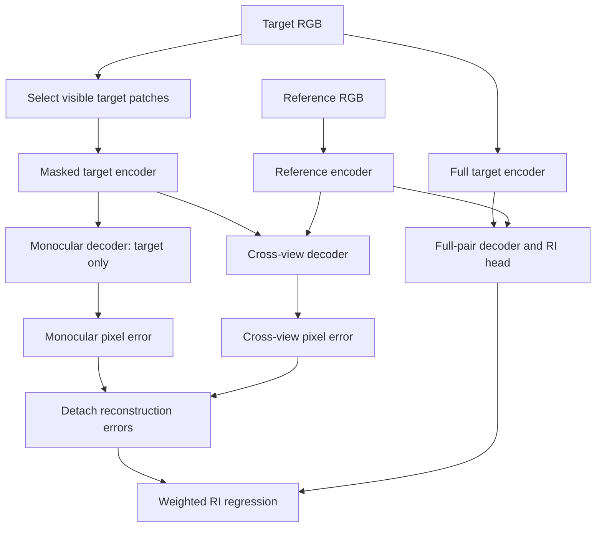

# Architecture and objective specification

The implemented primary path is [`LatentModel`](../src/models/latent.rs), described
in [the latent pipeline](latent-pipeline.md). The current experimental recipe uses
V-JEPA 2.1 Base features from the final block and block 6, six fusion blocks of
width 384 with six attention heads, and separate latent-completion and
relative-improvement heads. Original image-grid coordinates survive sparse
selection. Fusion uses 2D rotary attention; calibrated cameras and 3D rays are not
inputs to this checkpoint.

The optional [`SpatialDescriptor`](../src/heads/spatial.rs) adds a zero-initialized,
bounded correction from dense pair-conditioned fusion to centered block-6
features. It is a matching head, separate from sparse completion. Its correction
norm is at most the configured radius times the base feature norm. The
[registered experiment](spatial-descriptor-protocol.md) sets that radius to 0.25.
Checkpoint loading checks the optional head against the saved configuration and
rejects silently discarding trained parameters.

The numbered sections below retain the **original RGB design proposal**, including
its proposed widths and objectives. They do not describe the current latent
training recipe. Reference facts and differences are recorded in
[the source audit](source-audit.md); training an own fusion model on an audited
pretrained V-JEPA encoder is not encoder pretraining from scratch.

## 1. Model contract

For a target image `t` and reference set `R`, return target-aligned fused features
and a predicted reconstruction-improvement map. Support directional pair output
`score(t <- r)` separately from set output `score(t <- R)`.

| Input/output | Proposed shape | Meaning |
| --- | --- | --- |
| RGB group | `[B,V,3,H,W]` | One synchronized set, or an explicitly identified static-scene temporal set |
| View validity | `[B,V]` | Missing/padded cameras are excluded from attention and reductions |
| Per-view tokens | `[B,S_v,D_e]` | Shared encoder applied separately to each view |
| Token IDs | `[B,S_v]` | Original raster-grid IDs, never renumbered after selection |
| Token positions | `[B,S_v,2]` | Row/column coordinates at the encoder patch resolution |
| Dense target queries | `[B,N_t,D_f]` | Visible-token projections scattered into a canvas of learned mask tokens |
| Fused features | `[B,N_t,D_f]` | Context-dependent representation of the target |
| Reconstruction | `[B,3,H,W]` | Predicted normalized patch values; visualization has separate handling |
| Pair RI | `[B,1,H,W]` for one ordered edge | Utility of the specified reference for this target |
| Set RI | `[B,1,H,W]` | Utility of the entire reference set |
| Optional probabilities | Same map shapes | Separately calibrated, versioned transforms of RI scores |

`B` counts groups, `V` counts views, and `S_v` counts retained tokens. Temporal
clips, when added, use a distinct `[B,V,C,T,H,W]` representation. Neither `V` nor
camera IDs are supplied as the encoder's temporal axis.

Variable image sizes use resolution buckets initially. Choose dimensions
divisible by the patch size or carry an explicit padding mask through encoding,
attention, reconstruction, and metric reductions. Interpolation must not create
valid pixels in padded areas.

## 2. Per-view V-JEPA 2.1 interface

The initial profile uses the imported Base native image path: 16-pixel patches,
768-dimensional features, 12 encoder blocks. A 384-square view produces a 24 by
24 grid of 576 tokens. Keep the pretrained encoder in evaluation mode and outside
the optimizer initially. Train the feature projection, fusion decoder, mask
tokens, and prediction heads.

Use the final normalized encoder feature map first. The configuration must name
the selected output layer and normalization. Hierarchical feature fusion is a
later ablation with explicit projection sizes and parameter counts. V-JEPA's
latent predictor is unnecessary in ordinary fusion inference; importing it
temporarily to preserve checkpoint-loading parity does not make it part of the
Gekko model.

Preprocessing contracts:

1. Read lossless sRGB RGB in its recorded range. Float data already in `[0,1]`
   must not receive a second division by 255.
2. Apply a recorded resize/crop and its pixel-coordinate transform.
3. Apply V-JEPA's checkpoint-specific channel normalization for encoder input.
4. Construct reconstruction targets separately from the transformed sRGB image.
   Normalize each flattened RGB patch with a specified variance convention and
   epsilon. This does not change the pretrained encoder's input normalization.
5. For upstream loss parity, feed identical target tensors to both implementations;
   document the downstream sRGB-target choice as an adaptation if the reference
   training transform differs.

Native image-mode checkpoint parity is mandatory. Repeating one frame into a
video tubelet is a different mode and should be evaluated only as an ablation.
Actual video encoding may later use short same-camera clips with fixed frame
ordering, time interpretation, and causal/noncausal disclosure.

## 3. Decoder and heads

The main Base profile projects `D_e=768` to `D_f=512` and uses eight decoder
blocks with 16 attention heads and MLP ratio four. A diagnostic profile uses
`D_f=256`, four blocks, and eight heads. These profiles are separate models;
their results must never share an unlabeled row.

Each cross-view decoder block contains target self-attention, target-to-reference
cross-attention, and an MLP, with residual connections and explicit normalization.
Retain local 2D positions for both target and reference tokens. Local position is
an image coordinate cue, not proof of a geometric match. No camera extrinsics,
depth, semantic labels, or GT correspondence enters the main decoder.

Initially references remain independent encoder features, projected into shared
key/value space. A target attends to their concatenation. Use a shared reference
role embedding, not a learned absolute camera-slot embedding. This makes the
reference-set function order invariant in evaluation, up to floating-point
reduction order, while preserving the target role. View membership remains
available for per-view reductions and diagnostics. More complex inter-reference
attention is an ablation after this baseline.

The cross-view head maps each decoded patch token to `16*16*(3+1)` values: RGB
and one scalar RI channel per pixel. A separate MAE RGB head and mask token share
the decoder blocks. In MAE mode, the decoder's reference-attention slot receives
only the target sequence. Mirror the pinned reference block ordering for parity
before experimenting with bypassed cross-attention or a fully shared RGB head.
This head structure follows the inspected
[Gekko model](https://github.com/thibautloiseau/gekko/blob/63f0ec9957885ea82cc2f4637d502003fbf9afcb/models/gekko.py).

At inference, use the unmasked target plus references to obtain features and RI.
The reconstruction comparisons are training machinery and diagnostics. Ordinary
RI prediction does not require reconstructing both branches at inference.
Dense output from a sparse input still incurs dense target-decoder work.

## 4. Two-view training graph

Select a target mask `M`, where one denotes hidden pixels/patches. Start with
90% target masking and a full reference. The mask is sampled independently of
GT geometry. The two reconstruction branches use exactly the same visible target
tokens, image augmentation, normalization target, and loss support.



For pixel `p`, let `y_p` be the patch-normalized RGB target. Define RGB-channel
mean errors, so the loss scale is independent of RGB channel count:

```text
e_m(p) = mean_c (y_p,c - yhat_m(p,c))^2
e_x(p) = mean_c (y_p,c - yhat_x(p,c))^2
C(p)   = (e_m(p) - e_x(p)) / e_m(p)       # diagnostic when e_m is informative

L_m  = mean over masked valid pixels of e_m
L_x  = mean over masked valid pixels of e_x
L_RI = mean over masked valid pixels of
       (stopgrad(e_m - e_x) - stopgrad(e_m) * Chat)^2

L_pair = lambda_m * L_m + lambda_x * L_x + lambda_ri * L_RI
```

This mathematical core follows [Gekko Eq. 8](https://arxiv.org/html/2609.01530v1#S4).
Implement it without dividing by the MAE error. Start all three coefficients at
one and log their unweighted magnitudes and gradients. An RI gradient reaches the
shared network through `Chat`, but not through the detached error tensors.

Name two reproducibility modes explicitly:

- `paper_eq8`: the expression above; exactly zero MAE error supplies no direct
  RI-head gradient through its coefficient.
- `released_linear_eps`: replace the coefficient of `Chat` with
  `max(stopgrad(e_m), eps)`, initially `eps=1e-2`, matching the inspected
  [released criterion](https://github.com/thibautloiseau/gekko/blob/63f0ec9957885ea82cc2f4637d502003fbf9afcb/models/criterion.py).
  Use this for the initial code-matched objective, with the first mode as an
  explicit numerical ablation.

A raw RI output is linear and may be negative: a reference can make reconstruction
worse. Do not impose a sigmoid or clip negative labels in the main formulation.
For ideal nonnegative errors the mathematical ratio is at most one but unbounded
below; predictions need not obey even that upper bound. Probability calibration
is a separate evaluation operation, not a silent change to this loss.

Normalize by the actual number of masked valid pixels. Reject empty loss support.
Compute patch statistics, squared errors, detached targets, and reductions in
float32 even if attention/linear layers use lower precision. Preserve exact
mask semantics when accumulating gradients across variable-shaped batches.

## 5. Information leakage and cache rules

**Mask before any encoder self-attention.** Encoding the complete target and
then selecting visible features leaks hidden content through contextual tokens.
Freezing the encoder does not remove that leakage.

Dense patch projection followed by selection is valid for the initial correctness
path only because these patch embeddings have disjoint receptive fields and no
cross-patch normalization. It saves transformer work, not patch-projection work.
Sparse patchify is a subsequent performance optimization with its own parity gate.

Required separation:

- Full-target features belong only to the RI-prediction path and declared dense
  inference/probe tasks; never substitute them into the masked reconstructions.
- MAE must receive no reference tensors, cross-view state, or target features
  from a prior unmasked pass.
- A reference encoder may be reused between cross-view and RI paths when RGB,
  preprocessing, selected tokens, weights, and mode are identical.
- A masked target encoder result may be shared between MAE and cross-view paths.
  Its cache key includes the exact mask, transform, weight hash, and image hash.
- Generic precomputed dense target features cannot accelerate masked pretraining.
  Valid persistent caches are limited to mask-independent patch projections or
  exactly keyed frozen outputs; their storage and reuse costs must be measured.
- Data augmentation, normalization statistics, and feature memory must not import
  information across independently split scenes or future frames.

A required perturbation test modifies only hidden target pixels. Visible target
encoder tokens and both reconstruction predictions must remain unchanged; loss
targets may change. A separate test changes the reference and verifies that MAE
output is unchanged. The full-target RI path is allowed to respond to either.

## 6. Extending from pairs to sets

For target `t`, choose a nonempty unordered set `R` with one to three references
initially. Train one randomly chosen target per group; rotate the target over
updates. Training every target with every reference on every step is unnecessary
and changes compute approximately quadratically in view count.

Use two deliberately distinct quantities:

```text
pair utility: C_t|r = (e_m,t - e_x,t|r) / e_m,t
set utility:  C_t|R = (e_m,t - e_x,t|R) / e_m,t
```

The set decoder directly reconstructs using all references and predicts the set
quantity from the corresponding unmasked target/reference-set pass. Reuse the
same MAE baseline for a given target/mask. Pair utility is predicted by evaluating
the selected pair without the other references. Otherwise it measures a different
conditional quantity and must carry a different name.

Proposed multi-view objective:

```text
L = lambda_m * L_m
  + lambda_set_rgb * mean_sampled_sets(L_x,t|R)
  + lambda_set_ri  * mean_sampled_sets(L_RI,t|R)
  + lambda_pair   * mean_sampled_edges(L_x,t|r + L_RI,t|r)
```

Average each family separately; MAE is counted once per target. Start with one
set and one sampled reference edge per group, then measure the cost of the pair
term. Include a set-only ablation and a pair-only baseline. Keep loss weights
fixed as reference count changes.

Geometric union visibility is the logical OR of valid pair visibility labels.
Predicted set utility is not the maximum or sum of pair utilities: references can
be redundant or complementary. A leave-one-reference-out error difference can
measure marginal utility later, but costs additional decoder passes and is not a
replacement for geometric visibility or pair RI.

Use reference dropout and vary view count during training. At test, report seen
counts `V=2,3,4` and unseen counts such as `V=6,8` separately. Missing references
must follow the declared monocular fallback. Do not promise score monotonicity as
more views are added; measure degradation, redundancy, and calibration by `V`.

A simple baseline pools pair-conditioned features using uniform averaging, then
a second baseline uses predicted pair scores. The joint model must improve over
these under fixed total tokens as well as under equal per-view resolution.

## 7. Sparse execution is three separate choices

| Kind of sparsity | What is reduced | Main measurement |
| --- | --- | --- |
| Masked-target reconstruction | Target observations, fixed by SSL task | Mask rate and reconstruction support |
| Per-view encoder sparsity | Tokens passed through encoder blocks; optionally patchify work | Encoder kernels, latency, retained/context token counts |
| Fusion/reference sparsity | Keys/values or active pair edges | Decoder attention work and end-to-end latency |

Run reference keep ratios `1.0, 0.75, 0.5, 0.25, 0.125`; keep the RI query target
dense initially. The target reconstruction mask remains an independent variable.
Use stratified random or evenly distributed image-grid sampling before learned
routing. Preserve some exploration coverage when testing texture-based policies.

When references are sparsified, generate both cross-view error and RI prediction
with the **same reference subsets**. The label now measures utility under a
specific observation budget. Record that budget in every prediction/report.
Physical co-visibility remains a separate geometric property.

One later variant trains sparse RI-query targets. It must specify how missing
query locations are decoded, how uncertainty is reported, and whether dense
outputs are evaluated. A dense teacher distilled into a sparse student is another
named variant; it does not have the same objective as budget-conditioned RI.

Distinguish three implementations in benchmarks:

1. Dense encoding, dense fusion.
2. Dense encoding, then token gather before fusion.
3. Selected patch inputs and sparse contextual encoding, then fusion.

Only the third can support encoder-compute savings. A smaller returned tensor
does not prove less work. Packed/padded batching, gather/scatter, kernel launch,
host/device transfer, and full-target RI inference are included in costs.

Learned selection must use a cheap first-stage signal or previous eligible
observations. Running the complete expensive model to decide which tokens to
avoid is useful only if its amortized cost is demonstrated. A geometry-oracle
selector belongs in diagnostic bounds, never the deployable main model.

## 8. Complexity, state, and optional geometry

With selected view counts `S_v`, encoder attention scales roughly with
`sum_v S_v^2`; feed-forward work remains linear in `sum_v S_v`. One dense target
decoder has target self-attention cost proportional to `N_t^2` and cross-attention
cost proportional to `N_t * sum_r S_r`, per block. These are analytic operation
models, not measured speedups. Decoding every target multiplies decoder work.

Reference-set selection must retain original view membership and masks. Reject
duplicate image IDs from ordinary positive pairs. Stress-test repeated views,
unrelated references, all-padding views, one surviving token, and extreme aspect
ratios. Do not claim invariance to duplicate references: attention multiplicity
can change their weight even when ordering does not.

Temporal feature memory is deferred. If introduced, key it by scene, camera,
time, resolution, augmentation and encoder version; expose age and validity;
reset on identity changes. A shared image-grid cache across different cameras is
invalid. Moving-camera histories require correspondence-aware reuse or an
explicit approximation measured against fresh encoding.

Depth, pose, epipolar attention, pointmap and correspondence heads are optional
extensions with separate supervision labels. They are not required to train
the RGB-only fusion objective. Geometric probes first freeze fusion; end-to-end
geometric fine-tuning is a separately reported track.

## 9. Architecture verification gates

- Strict weight load, native image parity, full-mask ordering, sparse-mask
  position preservation, and image/video modality separation.
- Dense-all-token sparse path agrees with dense inference; sparse patchify agrees
  with ordinary patchify followed by selection before attention. Sparse-context
  embeddings are not expected to equal dense-context embeddings at retained IDs.
- Independent CPU/PyTorch scalar loss and gradient fixtures, including negative
  improvement, zero MAE error, epsilon boundary, padding and empty masks.
- RI error targets are detached; MAE is reference invariant; hidden-pixel leakage
  tests pass under every cache and sparse-kernel mode.
- `V=2` set path reduces to the declared pair architecture; reference order
  changes do not change eval outputs beyond registered numerical tolerance.
- A shuffled-reference control harms reference-dependent tasks on held-out
  informative regions. Failure is a modeling diagnostic, not something to hide.
- Save/reload and optimizer-resume checks reproduce outputs and the next update
  within the selected backend's documented determinism limits.
