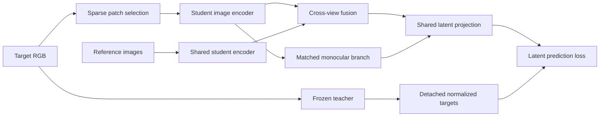

# Fixed V-JEPA latent prediction

The September 29 task amendment makes latent prediction the next primary
experiment. RGB pilots remain valid negative results: their blur is unresolved.
Changing the prediction space does not qualify those RGB outputs.
V-JEPA features are not a prescribed low-pass filter: they retain learned spatial
detail. The change removes exact RGB synthesis from the main objective; it does
not guarantee invariance to every texture, lighting change, or noise source.

The `latent_pilot` entry point learns a multi-view predictor from a sparse target
and one to three independently encoded reference images. The audited MIT V-JEPA
2.1 Base package initializes the student and a separate, permanently frozen
teacher. Fusion and prediction heads start randomly; no released Gekko weights,
noncommercial teacher, or previous RGB checkpoint enters this run.



At 256px the teacher emits 256 tokens of 768 channels. A parameter-free
per-token layer normalization with epsilon `1e-6` defines targets. Predictions
remain unconstrained. Both branches use the same projection and squared-error
objective. Main loss is the mean of their hidden-token MSEs; a separately
reported visible-token auxiliary loss has weight 0.1. This is a last-layer,
fixed-teacher experiment, not a reproduction of V-JEPA 2.1 pretraining: the
original uses dense prediction, hierarchical supervision, and a momentum target.
See the [V-JEPA 2.1 paper](https://arxiv.org/abs/2603.14482).

The sparse target removes hidden tokens before encoder attention. Full-target
teacher features enter only loss/metrics. They are not selected after a dense
student pass and are never predictor inputs. A distinct RI branch can encode
the full target with the student, independently of masked completion. It predicts
a patch scalar trained against `clamp((mono_mse-cross_mse)/max(mono_mse,1e-6),0,1)`
with stop-gradient. This is an adaptation of [Gekko's error comparison](https://arxiv.org/abs/2609.01530),
not a claim that semantic prediction gain equals geometric visibility.

The teacher has a non-autodiff backend and no optimizer. Student unfreezing uses
the existing observed-validation gate: wait at least 400 updates, require at
least 2% error reduction, and reject a greater than 10% regression from the best
probe. It opens the last two blocks, then the full image encoder including its
stem after a second gate. The encoder has its own AdamW state and a 0.05 learning
rate ratio. Frozen reference features and sparse student features are currently
computed online; no trainable feature cache can go stale.

The initial screen uses 256 training rooms and 16 disjoint validation rooms from
the existing immutable 8,192-room capture, at 256×256 with two references. It is
limited to 1,000 updates and 1,800 seconds plus bounded final evaluation. It does
not generate new data or access the test split. All GPU command time remains in
the existing Pilot 07 cumulative 12-hour ledger.

```sh
cargo test --workspace --locked
cargo build --profile pilot --no-default-features --features cuda --bin latent_pilot --locked
target/pilot/latent_pilot --config configs/archive/pilot-07/pilot07-latent-screen.toml \
  --run .data/runs/my-latent-study
# Exact continuation uses the same source/config/schedule and restores both optimizers.
target/pilot/latent_pilot --config configs/archive/pilot-07/pilot07-latent-screen.toml \
  --checkpoint .data/runs/my-latent-study/checkpoint-000200 \
  --run .data/runs/my-latent-continuation
```

Metrics include hidden latent MSE/cosine; matched monocular and unrelated-room
controls; a per-position constant predictor fitted only on training rooms;
prediction/teacher spatial variance; and hidden-input/reference-order audits.
The final evaluator reads renderer geometry only after prediction and compares
raw latent gain and learned RI against hidden-patch co-visibility. It excludes
patches with fewer than 128 known pixels and uses majority visibility among
known pixels. Scores are not calibrated visibility probabilities.

Exports preserve raw target/predicted latents, RGB context, per-patch gain/RI,
geometry labels, masks, and array layout. Any PCA illustration must use one
teacher-fitted basis and shared color limits for all compared predictions. PCA
colors are feature visualizations, not RGB reconstructions or evidence of sharp
image generation. Reports should include room-bootstrap intervals and feature
rank/variance checks before a larger latent study is justified. Later work must
test fresh scenes, multiple masks/seeds, semantic and correspondence utility,
and the sensitivity of the visibility proxy to semantic similarity.

Paper framing must distinguish the fixed-target adaptation from both original
Gekko and original V-JEPA pretraining. Compare pixel and latent objectives under
matched architecture/data/compute; separate raw error-gain ranking from a learned
RI head; and include same-room shuffled-token or spatial controls to distinguish
global scene context from geometric correspondence. Preserve all failed RGB
results and report them as motivation, not as evidence that a latent objective
solves image synthesis. Scale beyond the initial screen only after the paired
reference-utility and feature-diversity measurements justify it.

The continuation adds deterministic `train_mask` / `eval_mask` policies,
independent `eval_mask_ratio`, and audited `[warm_start]` weights-only phases.
Exact resume still restores both optimizers; a warm start resets them and the
unfreezing gate. Gate timing is configurable; the continuation uses 200-step
minimum stages. `encoder_stage_cap` defaults to 2 (full encoder), with 0 and 1
available for controlled frozen and final-two-block experiments.
`latent_assess` evaluates checkpoints using a shared TOML
protocol, with post-encoder spatial-shuffle controls and patch correspondence
against the original V-JEPA encoder. `hpatches_export` accepts RGB-only external
inputs; homography scoring runs separately on CPU. See the
[qualification and benchmark protocol](sota-evidence.md).

`stable_attention = true` is currently rejected for CUDA Fusion: full-graph
evaluation exposed unsupported float64 fusion despite an earlier narrow native
inference audit. Use the default float32 policy and retain measured input-order
rounding error in reports.

The latent encoder now calls `forward_image_capture_layers(..., &[])` to obtain
final tokens without creating unused hierarchical-output branches. During partial
unfreezing, the unused trainable output norms previously retained disconnected
autodiff graphs. A native batch-48, 200-update audit measured 113.2 MiB/update
growth with default captures, versus flat 14.92 GiB process VRAM with final-only
outputs; the maximum loss-trajectory difference was 1.20e-6. Dense/sparse CPU
outputs and active parameter gradients also match exactly. The default vendored
encoder API still returns hierarchical outputs for objectives that consume them.

The reproducible isolated diagnostic is `examples/latent_memory_audit.rs`, driven
by `configs/archive/pilot-07/pilot07-latent-memory-plan.toml` and analyzed by
`tools/legacy/latent_memory_report.py`. Its deterministic feature targets test memory,
not model quality. Training logs use the inner backend so metrics cannot create
extra differentiable branches. Historical training binaries remain archived for
exact optimizer continuation; changing source identity requires a weights-only
phase with explicitly reset optimizers.

## Fusion transfer auxiliaries

The fusion trunk has image-grid 2D RoPE in self- and cross-attention. It has no
camera intrinsics, extrinsics, rays, or shared world-coordinate encoding. Each
reference uses its own grid and the same reference-role embedding. The default
`cross_view_rope = true` is retained; disabling it leaves self-attention and the
monocular branch's RoPE intact. The [controlled transfer study](studies/pilot-07-fusion-transfer.md)
finds that simply removing cross-view RoPE does not repair real-view matching.

Optional dense pair objectives address the difference between sparse completion
training and full-image matching. They use a separate full-target student branch,
without passing its tokens into the sparse predictor. For example:

```toml
cross_view_rope = true

[fusion_auxiliary]
attention_weight = 0.1
dense_weight = 0.1
descriptor_weight = 0.1
bidirectional = true
teacher_temperature = 0.07
anchor_warm_start = true
```

All auxiliary weights default to zero. `anchor_warm_start = true` requires an
audited `[warm_start]` checkpoint. Its encoder is frozen as a separate semantic
teacher, including across exact optimizer resumes; the main fixed V-JEPA teacher
is unchanged. The affinity target removes each image's token-mean feature offset
and takes a temperature-scaled cosine softmax. It is detached before any loss
operation. These soft labels are not known geometric correspondences.

`attention_weight` guides mean-head scores in each decoder layer. `dense_weight`
preserves normalized ancestor latents through the existing prediction head.
`descriptor_weight` directly aligns cosine affinities between the two fused
feature sets; it requires `bidirectional = true` and sends gradients through both
descriptor branches. Bidirectional dense/attention losses average the directions
so their weight does not double. The initial descriptor comparison is a screen,
not a generally qualified default recipe.

The common correspondence export now retains raw and centered encoder, decoder,
and prediction-head descriptors, historical reciprocal probabilities, reciprocal
raw logits, and reciprocal log-conditional scores. The last readout removes the
row-offset ambiguity left by KL supervision. Six additional controls apply the
same reciprocal normalization to raw and centered teacher, student-encoder and
decoder cosine scores, at a fixed temperature of 0.07. These distinguish a
readout gain from a learned-feature gain; they do not change training. A diagnostic-only full layer/PE
trace remains separate from the training forward pass to avoid unused autodiff
branches. `latent_assess.references` can override the reference count for matched
one/two/three-reference evaluations on four-view captures.

`eth3d_export` requires a checksummed candidate-selection record before accepting
the complete 3,365-pair RGB manifest. Its separate CPU scorer reads point labels
and reports scene/interval means, point-weighted PCK, and scene-bootstrap paired
differences. This local hard-patch readout does not reproduce published dense
refinement pipelines, so its scores cannot establish leaderboard parity.
## Relationship to the original Gekko RI loss

This latent pipeline is an adaptation, not an exact reproduction of the paper's
RGB objective. The current RI head regresses a detached, clipped relative latent
error gain with ordinary MSE. In [Gekko, equation 8](https://arxiv.org/html/2609.01530v1),
the residual is instead `stopgrad(e_mono - e_cross) - stopgrad(e_mono) * ri`.
That formulation weights the relative-gain residual by monocular error, reducing
the contribution of locations where monocular reconstruction is already easy.
It also does not apply the current latent implementation's clipping operation.

Confidence weighting could be a useful controlled co-visibility experiment.
It is not enabled in the fusion-transfer screens, and is not assumed to improve
correspondence. A latent version must account for its different error scale,
keep both reconstruction errors detached, and compare RI ranking and primary
latent prediction against the same unchanged control. Changing this objective
requires a new training phase and provenance identity, not an exact resume.
